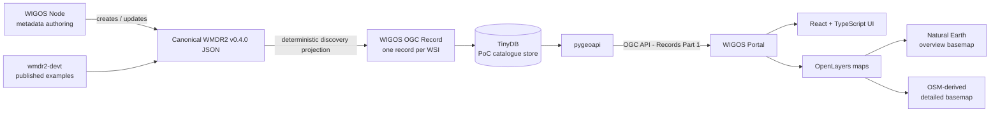
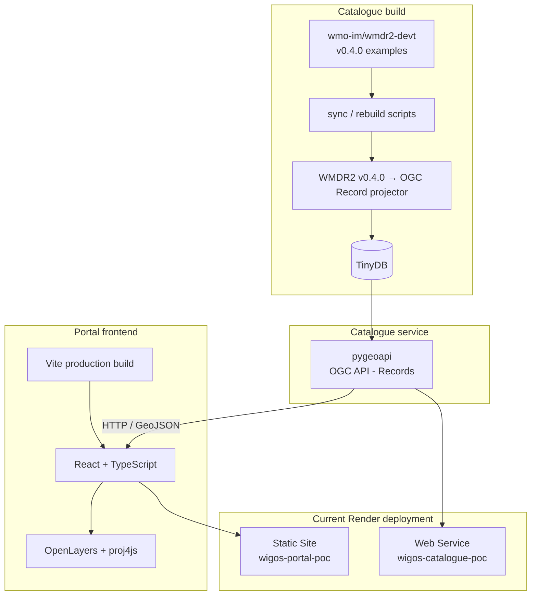

# WIGOS Portal PoC

Proof of concept for **discovery, filtering and map-based exploration of WIGOS facilities and their observations** using WMDR2 metadata.

The Portal is the read/discovery counterpart to the WIGOS Node PoC:

- **WIGOS Node** authors and maintains canonical WMDR2 JSON;
- the **catalogue projection** derives discovery-oriented OGC Records from WMDR2;
- **pygeoapi** exposes those records through OGC API - Records Part 1;
- the **WIGOS Portal** provides map-based search, cascading facets and compact facility reports.

> **PoC status:** this repository demonstrates the architecture and interaction model. It is not a production WIGOS Portal.

## 1. Current WMDR2 baseline

The catalogue projector targets the **wmdr2-devt v0.4.0** model, which itself builds on the official wmdr2 1.99.dev1.

The current published examples use the v0.4.0 structures directly:

- Facility `properties.observations[]`;
- Observation `configurations[]`;
- Observation `programAffiliations[]` with `programAffiliation`, optional `reportingStatus`, and optional `dates`;
- Facility `territories[]` with `territory` and optional `dates`;
- controlled values as Concept objects with compact `id` and, where known, canonical `url`;
- reusable Facility `instruments[]`, referenced by `Configuration.instrument`;
- root `temporalGeometry` for location history/moving facilities;
- OGC Contact objects with contextual `roles[]`.

The catalogue no longer depends on the older `observationSeries`, `observingConfigurations`, `deployments`, `temporalTerritory`, or facility-level programme-affiliation aliases.

On 2026-09-30 the published `results/wmdr2_json_examples` directory was checked end-to-end: **20 complete Facility records**, **319 Observations**, and **338 Configurations**. All checked Observations use `configurations[]` and `programAffiliations[]`; all Facilities have `territories[]`; and all referenced instrument IDs resolve against the record-local instrument catalogue.

## 2. Purpose and scope

The Portal is deliberately **read-only**. WMDR2 JSON remains authoritative. The Portal does not maintain a second station-metadata model.

The current PoC supports:

- one catalogue record per WIGOS Facility / WSI;
- text search and map-based selection;
- cascading/faceted filtering by programme, observed property, observing method, instrument model and organization;
- global map display in **Mollweide**;
- **Arctic** and **Antarctic** polar stereographic views;
- zooming, panning and box selection;
- a gated **Detailed map** based on OpenStreetMap/Web Mercator once the user has zoomed into a sufficiently small area;
- interactive facility points with hover and selection;
- compact facility summaries including contacts and organizations;
- OGC API - Records Part 1 as the interface between catalogue and Portal.

## 3. Architecture

### 3.1 Architectural principles

1. **WMDR2 JSON is canonical.** OGC Records are a rebuildable discovery projection.
2. **One OGC Record represents one WIGOS Facility.** Observation, programme, instrument and method information is flattened only where useful for discovery.
3. **The Portal talks to a standards-based catalogue API.** It does not depend on TinyDB internals.
4. **Authoring and discovery remain separate.** Editing belongs in the WIGOS Node; exploration belongs in the Portal.

### 3.2 Logical architecture



A future operational catalogue may use different storage/index technology or ingest records from operational WIGOS Nodes. The intended stable boundary is the OGC API - Records interface.

### 3.3 Current PoC deployment



Current deployments:

- Portal: `https://wigos-portal-poc.onrender.com`
- Catalogue: `https://wigos-catalogue-poc.onrender.com`

## 4. Technology stack

### Frontend

| Technology | Role |
|---|---|
| React | Component-based interactive UI |
| TypeScript | Static typing |
| Vite | Development server and production build |
| OpenLayers | Mapping, interaction, layers and reprojection |
| proj4js | Mollweide and polar stereographic projection support |

Vite is a build/development tool; it is not the production application server. The deployed Portal is static HTML/CSS/JavaScript.

### Catalogue/backend

| Technology | Role |
|---|---|
| Python | Synchronization and projection tooling |
| pygeoapi | OGC API - Records implementation |
| TinyDB | Lightweight PoC catalogue store |
| WMDR2 JSON | Canonical metadata representation |

TinyDB is intentionally a PoC choice. Production storage can change without changing the Portal API contract.

## 5. WMDR2 → discovery projection

The PoC builds from:

```text
https://github.com/wmo-im/wmdr2-devt/tree/main/results/wmdr2_json_examples
```

A catalogue rebuild can either synchronize the published examples or read directly from a local `wmdr2-devt` clone.

### Identity and duplicate selection

- root WMDR2 Feature `id` is the primary WSI and becomes the OGC Record `id`;
- `properties.additionalIds` is preserved for additional WSIs;
- generic OGC `properties.externalIds` is preserved **unchanged**; the projector does not insert a synthetic WSI external ID;
- if several complete source files represent the same WSI, selection is deterministic: `properties.updated`, then `properties.created`, then a leading `YYYYMMDD` filename date.

### Controlled concepts

WMDR2 v0.4.0 Concept objects use compact `id` plus optional canonical `url`, for example:

```json
{
  "id": "GAW",
  "url": "http://codes.wmo.int/wmdr/ProgramAffiliation/GAW"
}
```

For flattened discovery/query fields, the projector uses the **canonical `url` as the machine value when present**. This preserves globally unambiguous query values while the Portal displays the last path component as a compact label. If a known controlled value has only an identifier and no URI, it is preserved and reported in the build warnings; no URI is invented.

### Time and `current*` fields

- OGC Record `time` is the Facility lifetime.
- An Observation is current when at least one `Configuration.time` interval contains the catalogue evaluation date.
- `operatingStatus` remains an independent assertion and is not used as a synonym for temporal validity.
- Programme affiliation `dates`, when present, are respected when deriving `currentProgrammes`; missing dates mean that no temporal qualifier was supplied.
- Observation temporal history remains canonical in `configurations[]`; the catalogue stores only derived discovery fields.

### Territory

The flattened `territory` discovery property is selected from `properties.territories[]`. A territory whose `dates` contains the evaluation date is preferred; otherwise the latest available occurrence is used.

### Instruments and observing methods

`Configuration.instrument` is resolved against `properties.instruments[].id`. Instrument manufacturer/model and `Instrument.observingMethods[]` are included in the discovery projection when referenced by a Configuration. This is important when a Configuration does not itself carry an `observingMethod`.

### Contacts and organizations

Facility `contacts[]` is retained as the standard OGC Record contact property. The convenience `organizations[]` facet is derived from Facility, Observation and Configuration contact occurrences, while the contextual contact occurrences remain in canonical WMDR2.

### Discovery fields

Important flattened properties include:

```text
facilityType
territory
wmoRegion
programmes
currentProgrammes
observedProperties
currentObservedProperties
observedGeometries
observingMethods
currentObservingMethods
instrumentManufacturers
currentInstrumentManufacturers
instrumentModels
currentInstrumentModels
currentObservationOperatingStatuses
organizations
observationCount
currentObservationCount
mobile
```

See `docs/WIGOS_RECORDS_PROFILE.md` for the detailed PoC profile.

## 6. Cascading filtering

The Portal implements **faceted/cascading selectors**, not independent dropdowns.

Each selector is populated from facilities satisfying all the *other* active filters. For example, after selecting a programme, the observed-property, observing-method, instrument and organization lists show only compatible values. Counts show how many facilities would remain for each choice.

The selector currently being edited is evaluated while ignoring its own value, so users can switch directly between compatible values without clearing the previous selection first.

For the current small dataset, facet computation is client-side. The same interaction model can later move to catalogue-side queryables/CQL2.

## 7. Map strategy

### Overview maps

| View | Projection |
|---|---|
| Global | Mollweide (`ESRI:54009`) |
| Arctic | Polar stereographic (`EPSG:3995`) |
| Antarctic | Polar stereographic (`EPSG:3031`) |

Natural Earth 1:110m vectors are bundled and reprojected in the browser.

### Detailed map

The detailed Web Mercator/OSM view is **not** a fourth peer projection. It becomes available only after the overview map has been zoomed to a sufficiently small geographic extent.

Current first-pass thresholds:

- longitude span ≤ 60°;
- latitude span ≤ 45°;
- viewport centre within the practical Web Mercator latitude range.

`Detailed map` preserves the selected area. `Back to overview` returns to the previous Global/Arctic/Antarctic projection and extent. The switch is always explicit; the Portal does not change projection automatically while a user zooms.

The public OSM raster service is suitable for this PoC only. Production should use an appropriate hosted/WMO-operated OSM-derived raster or vector-tile service.

## 8. Repository layout

```text
wigos-portal-poc/
├── README.md
├── requirements.txt
├── requirements-dev.txt
├── render.yaml
├── catalogue/
│   ├── pygeoapi-config.yml
│   └── templates/_base.html
├── docs/
│   ├── ARCHITECTURE.md
│   └── WIGOS_RECORDS_PROFILE.md
├── frontend/
│   ├── package.json
│   ├── pnpm-lock.yaml
│   ├── public/basemap/
│   └── src/
├── scripts/
│   ├── build_catalogue.py
│   ├── rebuild_catalogue.py
│   ├── run_catalogue.py
│   ├── sync_wmdr2_examples.py
│   └── wmdr2_projection.py
├── tests/
└── data/                  # generated/cache data; git-ignored
```

Generated catalogue data, synchronized examples, build reports, `catalogue/openapi.yml`, frontend build output, virtual environments and `node_modules` should remain untracked.

## 9. Local development

### 9.1 Python environment

From the repository root:

```bash
cd ~/Documents/git/wigos-portal-poc
python -m venv .venv
source .venv/bin/activate
python -m pip install -r requirements-dev.txt
```

### 9.2 Test the catalogue projection

```bash
pytest -q
```

The v0.4.0 projection test set covers root WSI identity, Concept URL handling, canonical `observations[]`/`configurations[]`, territory dates, programme dates, instrument references/methods, contacts/organizations, moving facilities and deterministic duplicate selection. It also checks the pygeoapi custom template/configuration used for the Catalogue documentation link.

### 9.3 Rebuild from published examples

```bash
python scripts/rebuild_catalogue.py
```

Or use an adjacent local clone while changing `wmdr2-devt`:

```bash
python scripts/rebuild_catalogue.py \
  --source-dir ../wmdr2-devt/results/wmdr2_json_examples
```

The build report is written to:

```text
data/records/build-report.json
```

It records `wmdr2ModelVersion`, evaluation date, source selection, duplicates/skips and any controlled values for which no canonical URI was available.

### 9.4 Run the catalogue

```bash
python scripts/run_catalogue.py
```

The pygeoapi HTML pages use a single repository-owned override of pygeoapi
0.24.0's `_base.html`. It adds a **Documentation** link beside the pygeoapi
logo pointing to this repository README. All other HTML templates continue to
fall back to the templates packaged with pygeoapi. When pygeoapi is upgraded,
compare `catalogue/templates/_base.html` with the upstream `_base.html` before
accepting the upgrade.

Useful local endpoints:

```text
http://localhost:5000/collections/wigos-facilities
http://localhost:5000/collections/wigos-facilities/items
http://localhost:5000/collections/wigos-facilities/queryables
```

### 9.5 Run the Portal

In a second terminal:

```bash
cd ~/Documents/git/wigos-portal-poc/frontend
npm run dev
```

or:

```bash
pnpm run dev
```

Vite normally serves `http://localhost:5173`.

Production build:

```bash
pnpm run build
```

## 10. Render deployment

### Catalogue Web Service

```text
Build command:
bash scripts/render_build_catalogue.sh

Start command:
gunicorn --bind 0.0.0.0:$PORT --workers 1 --threads 4 --timeout 120 --access-logfile - --error-logfile - pygeoapi.flask_app:APP
```

Relevant environment variables:

```text
PYGEOAPI_CONFIG=catalogue/pygeoapi-config.yml
PYGEOAPI_OPENAPI=catalogue/openapi.yml
WIGOS_CATALOGUE_DB=data/wigos-facilities.tinydb
PYGEOAPI_SERVER_URL=https://wigos-catalogue-poc.onrender.com
```

### Portal Static Site

```text
Root Directory:
frontend

Build command:
corepack enable && corepack prepare pnpm@10.34.5 --activate && pnpm install --frozen-lockfile && pnpm run build

Publish Directory:
dist
```

The frontend catalogue endpoint is supplied through `VITE_RECORDS_API_BASE` at build time.

## 11. Production evolution

The current frontend stack (React + TypeScript + Vite + OpenLayers) and standards boundary (OGC API - Records) can evolve directly toward production. Expected production work includes:

- production catalogue storage/indexing and server-side faceting;
- operational WMDR2 publication/ingestion rather than example synchronization;
- production basemap/vector-tile service;
- monitoring, observability and availability controls;
- accessibility/responsive-layout review;
- performance tests at realistic global catalogue volume;
- richer Facility/Observation reports and temporal summaries;
- authentication/authorization where future workflows require it.

The architectural boundary should remain:

```text
canonical WMDR2
      ↓
rebuildable discovery projection
      ↓
OGC API - Records
      ↓
WIGOS Portal
```

## 12. Related projects and standards

- `wmo-im/wmdr2-devt` — WMDR2 development model, currently v0.4.0
- `wmo-im/wmdr2` — official WMDR2 schema work reused by v0.4.0
- WIGOS Node PoC — companion authoring/editing application
- OGC API - Records Part 1 — catalogue/discovery API
- pygeoapi — OGC API server implementation
- OpenLayers — browser mapping library
- Natural Earth — overview basemap data
- OpenStreetMap — detailed PoC basemap data
