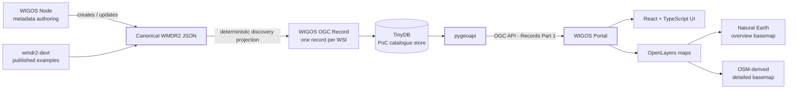
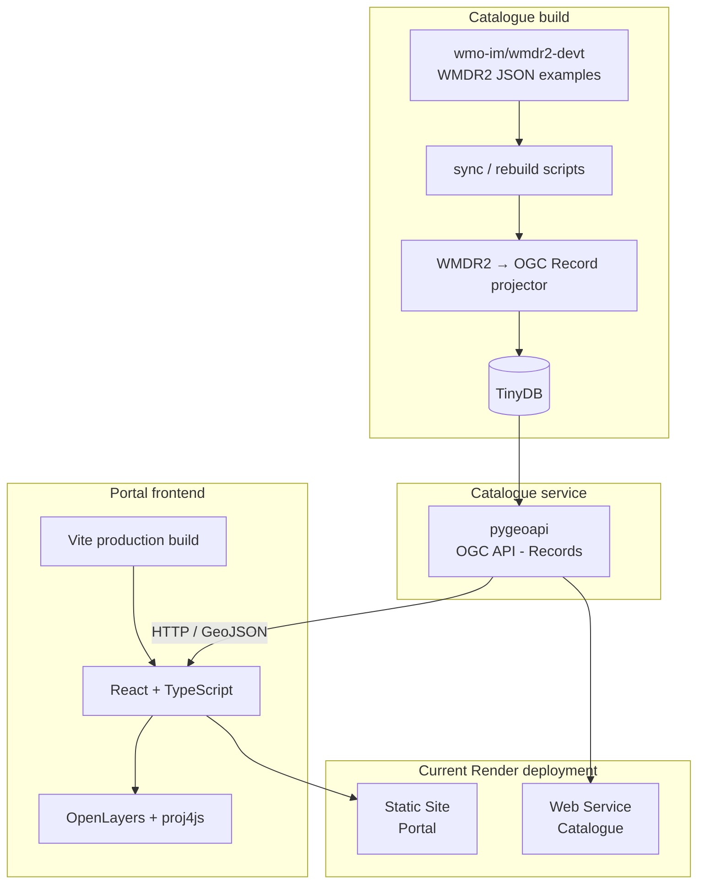

# WIGOS Portal PoC

Proof of concept for **discovery, filtering and map-based exploration of WIGOS facilities and their observations** using WMDR2 metadata.

The Portal is the read/discovery counterpart to the WIGOS Node PoC:

- **WIGOS Node** authors and maintains canonical WMDR2 JSON;
- the **catalogue projection** derives discovery-oriented OGC Records from WMDR2;
- **pygeoapi** exposes those records through OGC API - Records Part 1;
- the **WIGOS Portal** provides map-based search, faceted filtering and compact facility reports.

> **PoC status:** this repository demonstrates the architecture and interaction model. It is not yet a production WIGOS Portal.

---

## 1. Purpose and scope

The Portal is deliberately **read-only**. WMDR2 JSON remains the authoritative metadata representation. The Portal does not maintain a second station-metadata model.

The current PoC supports:

- facility discovery from published WMDR2 JSON examples;
- one catalogue record per WIGOS facility / WSI;
- global map display in **Mollweide** projection;
- **Arctic** and **Antarctic** polar stereographic views;
- zooming, panning and box selection;
- a gated **Detailed map** based on OpenStreetMap/Web Mercator once the user has zoomed into a sufficiently small area;
- interactive facility points with hover and selection;
- text search;
- cascading/faceted filtering by:
  - programme;
  - observed property;
  - observing method;
  - instrument model;
  - organization;
- compact facility summaries;
- OGC API - Records Part 1 as the interface between catalogue and Portal.

Future work may add richer facility reports, observation-availability summaries, server-side faceting/CQL2, moving-station trajectories and production-grade basemap services.

---

## 2. Architecture

### 2.1 Architectural principles

The PoC follows four main principles.

1. **WMDR2 JSON is canonical.**
   OGC Records are a discovery projection and can be regenerated at any time.

2. **One OGC Record represents one WIGOS Facility.**
   Observation series, programmes, instruments, observing methods and organizations are exposed as discovery properties of the facility record rather than separate top-level catalogue records in this PoC.

3. **The Portal talks to the catalogue through a standard interface.**
   The frontend depends on **OGC API - Records Part 1**, not on TinyDB or pygeoapi internals.

4. **Authoring and discovery remain separate concerns.**
   Editing belongs in the WIGOS Node; the Portal is optimized for search, exploration and presentation.

### 2.2 Logical architecture



In a future operational system, the source of canonical WMDR2 records may be a registry or distributed set of WIGOS Nodes rather than the example directory used by this PoC. The interface between the Portal and catalogue is intended to remain standards-based.

### 2.3 Current PoC deployment



The current deployed services are:

- Portal: `https://wigos-portal-poc.onrender.com`
- Catalogue: `https://wigos-catalogue-poc.onrender.com`

The catalogue service has been hidden behind a same-origin `/api` proxy without changing the logical architecture, but can also be called independently.

---

## 3. Technology stack

### Frontend

| Technology | Role |
|---|---|
| **React** | Component-based interactive UI |
| **TypeScript** | Static typing and safer application code |
| **Vite** | Development server and production frontend build |
| **OpenLayers** | Mapping, interaction, vector/raster layers and reprojection |
| **proj4js** | Support for Mollweide and polar stereographic projections |

React is used because the Portal has substantial interdependent UI state: filters, selected facility, map extent, projection, hover state and report content. Vite is the build/development tool; the production deployment consists of static HTML/CSS/JavaScript assets generated by Vite.

### Catalogue/backend

| Technology | Role |
|---|---|
| **Python** | Synchronization, projection and service tooling |
| **pygeoapi** | OGC API - Records implementation |
| **TinyDB** | Lightweight PoC catalogue store |
| **WMDR2 JSON** | Canonical metadata representation |

TinyDB is intentionally a PoC choice. A production catalogue could use PostgreSQL/PostGIS, Elasticsearch/OpenSearch or another backend without changing the Portal's standards-based API contract.

### Basemap data

- **Natural Earth 1:110m** vectors are bundled for global and polar overview maps.
- **OpenStreetMap** tiles are currently used for the detailed Web Mercator view during PoC development.

The public OSM tile service must not be treated as the production WIGOS basemap service. A production deployment should use an appropriate hosted or WMO-operated OSM-derived raster/vector tile service.

---

## 4. Data flow and WIGOS Records projection

The current PoC builds its catalogue from the published WMDR2 examples in:

```text
https://github.com/wmo-im/wmdr2-devt/tree/main/results/wmdr2_json_examples
```

The source directory also contains converter fragments. The build process identifies complete facility records and ignores fragments.

If several complete WMDR2 files represent the same WSI, the catalogue builder selects the most recent record using a fixed precedence rule, ensuring reproducible catalogue builds:

1. newest `properties.updated`, when available;
2. otherwise newest `properties.created`;
3. otherwise a date encoded in the filename.

The resulting discovery projection follows these rules:

- **one OGC Record per WSI**;
- WSI is the OGC Record `id`;
- facility lifetime maps to OGC Record `time`;
- controlled concepts retain their canonical URI values where available;
- legacy/non-URI values are preserved and reported rather than silently rewritten;
- current observation-related facets are derived from time-valid `ObservingConfiguration` instances;
- operating status is kept distinct from temporal validity;
- contacts are mapped to standard OGC Record contact structures;
- organizations and other frequently searched WIGOS properties may also be flattened into dedicated discovery/queryable properties.

Because the catalogue representation is derived, improvements to the WMDR2 converter flow into the Portal after the catalogue is rebuilt.

---

## 5. Faceted filtering

The Portal implements **cascading facets** rather than independent dropdowns.

For each selector, available options are calculated from facilities satisfying all the *other* active filters. For example:

```text
Programme = GAW
Observed property = carbon dioxide
```

causes the observing-method, instrument and organization selectors to contain only values compatible with that combination.

The selector being edited is evaluated while temporarily ignoring its own current value. This allows a user to change, for example, from one compatible programme to another without first clearing the current programme.

Counts are displayed with each option:

```text
GAW (7)
GCW (3)
```

For the small PoC dataset, faceting is performed client-side. The intended production evolution is to preserve the same interaction model while moving filtering/facet computation to the catalogue using suitable OGC API queryables/CQL2 once scale requires it.

---

## 6. Map strategy

### Overview maps

The three overview projections are:

| View | Projection |
|---|---|
| Global | Mollweide (`ESRI:54009`) |
| Arctic | Polar stereographic (`EPSG:3995`) |
| Antarctic | Polar stereographic (`EPSG:3031`) |

Natural Earth vectors are reprojected in the browser by OpenLayers.

### Detailed map

The detailed OSM/Web Mercator map is **not** presented as a fourth peer projection.

Instead:

1. the user starts in Global, Arctic or Antarctic overview mode;
2. after zooming into a sufficiently small geographic extent, a **Detailed map** control becomes available;
3. the user explicitly switches to the detailed Web Mercator/OSM view;
4. **Back to overview** returns to the previous overview projection and extent.

The first-pass threshold is approximately:

- longitude span ≤ 60°;
- latitude span ≤ 45°;
- viewport centre within the practical Web Mercator latitude range.

This is deliberately based on geographic extent rather than OpenLayers zoom numbers, because zoom values are projection-dependent.

---

## 7. Repository layout

```text
wigos-portal-poc/
├── README.md
├── requirements.txt
├── render.yaml
├── catalogue/
│   └── pygeoapi-config.yml
├── frontend/
│   ├── package.json
│   ├── pnpm-lock.yaml
│   ├── public/
│   │   └── basemap/
│   └── src/
│       ├── api/
│       ├── components/
│       └── map/
├── scripts/
│   ├── build_catalogue.py
│   ├── rebuild_catalogue.py
│   ├── run_catalogue.py
│   ├── sync_wmdr2_examples.py
│   └── wmdr2_projection.py
├── tests/
└── data/                  # generated/cache data; normally git-ignored
```

Generated catalogue data, synchronized upstream examples, build reports, `catalogue/openapi.yml`, frontend build output, virtual environments and `node_modules` should remain untracked.

---

## 8. Local development

The examples below assume the repository is cloned as:

```text
~/Documents/git/wigos-portal-poc
```

### 8.1 Python environment

From the repository root:

```bash
cd ~/Documents/git/wigos-portal-poc
python -m venv .venv
source .venv/bin/activate
python -m pip install -r requirements.txt
```

### 8.2 Build/rebuild the catalogue

Using the published WMDR2 examples:

```bash
python scripts/rebuild_catalogue.py
```

Or, when `wmdr2-devt` is cloned next to this repository:

```bash
python scripts/rebuild_catalogue.py --source-dir ../wmdr2-devt/results/wmdr2_json_examples
```

Run tests with:

```bash
python -m unittest discover -s tests -v
```

### 8.3 Run the catalogue service

With the virtual environment active:

```bash
python scripts/run_catalogue.py
```

The local catalogue is normally available at:

```text
http://localhost:5000
```

Useful endpoints include:

```text
http://localhost:5000/collections/wigos-facilities
http://localhost:5000/collections/wigos-facilities/items
http://localhost:5000/collections/wigos-facilities/queryables
```

### 8.4 Run the Portal frontend

In a second terminal:

```bash
cd ~/Documents/git/wigos-portal-poc/frontend
npm run dev
```

or:

```bash
pnpm run dev
```

Vite normally serves the application at:

```text
http://localhost:5173
```

For a production build:

```bash
pnpm run build
```

The resulting static site is written to `frontend/dist/`.

---

## 9. Render deployment

### Catalogue web service

The catalogue is deployed as a Render Web Service using pygeoapi.

Typical settings:

```text
Build command:
bash scripts/render_build_catalogue.sh

Start command:
gunicorn --bind 0.0.0.0:$PORT --workers 1 --threads 4 --timeout 120 --access-logfile - --error-logfile - pygeoapi.flask_app:APP
```

Relevant environment variables include:

```text
PYGEOAPI_CONFIG=catalogue/pygeoapi-config.yml
PYGEOAPI_OPENAPI=catalogue/openapi.yml
WIGOS_CATALOGUE_DB=data/wigos-facilities.tinydb
PYGEOAPI_SERVER_URL=https://wigos-catalogue-poc.onrender.com
```

### Portal static site

The Portal is deployed as a Render Static Site with:

```text
Root Directory:
frontend

Build command:
corepack enable && corepack prepare pnpm@10.34.5 --activate && pnpm install --frozen-lockfile && pnpm run build

Publish Directory:
dist
```

The frontend catalogue endpoint is provided at build time through `VITE_RECORDS_API_BASE`.

---

## 10. Production evolution

The PoC stack is intentionally close to a plausible production architecture. React, TypeScript, Vite, OpenLayers and pygeoapi are not considered disposable prototypes.

Before operational deployment, likely work includes:

- production catalogue storage and indexing;
- catalogue-side faceting/query execution;
- authentication/authorization where required;
- health, monitoring and observability;
- production-grade basemap/vector-tile service;
- accessibility and responsive-layout review;
- performance testing with realistic global record volumes;
- stronger catalogue-build validation and provenance reporting;
- richer facility reports and observation temporal summaries;
- integration with operational WIGOS Node/catalogue publication workflows.

The architectural boundary should remain:

```text
canonical WMDR2 metadata
        ↓
rebuildable discovery projection
        ↓
OGC API - Records
        ↓
Portal
```

This keeps metadata semantics in WMDR2 while allowing the catalogue and frontend technologies to evolve independently.

---

## 11. Related projects and standards

- **WMDR2 development:** `wmo-im/wmdr2-devt`
- **WIGOS Node PoC:** companion authoring/editing application
- **OGC API - Records Part 1:** catalogue/discovery API used by this PoC
- **pygeoapi:** OGC API server implementation
- **OpenLayers:** browser mapping library
- **Natural Earth:** overview basemap data
- **OpenStreetMap:** detailed PoC basemap data
